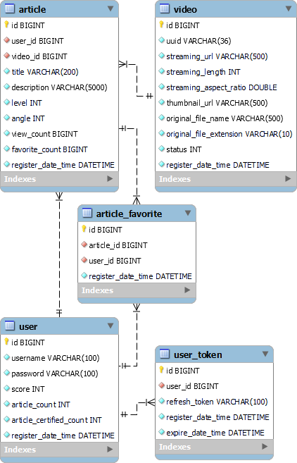

# gripp-backend

## 📔 API Documentation

**https://gripp.dev.njw.kr/swagger-ui**

- require an admin username and password

## ⚙️ Admin Tool

**https://gripp.dev.njw.kr/admin**

- require an admin username and password

## 🏗️ ERD

